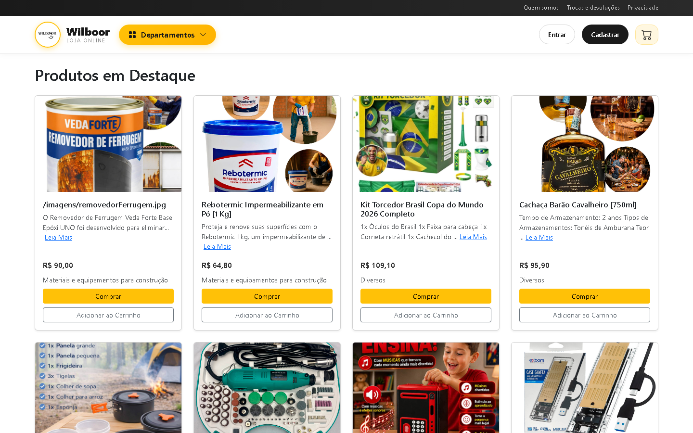

# Wilboor.com.br

E-commerce completo desenvolvido com React no frontend e Node.js/Express no backend, com integração ao Mercado Pago para pagamentos e Melhor Envio para cálculo de frete.



---

## Visão Geral

| Camada | Tecnologia |
|--------|-----------|
| Frontend | React 19, React Router v7, Axios, Bootstrap 5 |
| Backend | Node.js, Express 5, Mongoose 9 |
| Banco de dados | MongoDB |
| Autenticação | JWT (access token + refresh token) |
| Pagamentos | Mercado Pago API |
| Frete | Melhor Envio API |
| E-mail | Nodemailer (SMTP) |

---

## Funcionalidades

### Área do Cliente
- Cadastro com validação de CPF (dígitos verificadores)
- Login com verificação de e-mail
- Conta e edição de dados pessoais
- Carrinho de compras com cálculo de frete por CEP
- Checkout com geração de link de pagamento Mercado Pago (PIX/cartão)

### Painel Administrativo
- Gerenciar produtos: criar, editar, deletar, destacar, pausar/publicar
- Gerenciar clientes: busca por nome, e-mail, CPF; visualização de dados completos
- Produtos pausados somem do site mas permanecem no banco

### API
- Rotas públicas e privadas (middleware JWT)
- Rate limiting e proteção com Helmet
- CORS configurável por variável de ambiente
- Webhook para notificações de pagamento do Mercado Pago

---

## Estrutura do Projeto

```
wilboor.com.br/
├── backend/
│   ├── controllers/         # Lógica de negócio
│   ├── middleware/          # Auth, rate limiter, validadores
│   ├── models/              # Schemas Mongoose (User, Product, Category)
│   ├── routes/              # Definição das rotas Express
│   ├── scripts/             # Scripts auxiliares (ex: setCpf.js)
│   ├── utils/               # Mailer e utilitários
│   ├── .env.example         # Modelo de variáveis de ambiente
│   └── server.js            # Entrada do servidor
└── frontend/
    ├── public/
    └── src/
        ├── components/
        │   ├── admin/       # Painel administrativo
        │   ├── auth/        # Login, cadastro, conta, verificação
        │   ├── cart/        # Carrinho e checkout
        │   └── ...
        ├── context/         # CartContext
        ├── services/        # api.js (Axios com interceptors)
        └── App.js
```

---

## Pré-requisitos

- **Node.js** >= 18
- **MongoDB** rodando localmente ou URI de banco remoto
- Conta no **Mercado Pago** (access token)
- Conta no **Melhor Envio** (token de API)
- Servidor **SMTP** para envio de e-mails

---

## Instalação e Execução

### 1. Clone o repositório

```bash
git clone https://github.com/<seu-usuario>/wilboor.com.br.git
cd wilboor.com.br
```

### 2. Configure o Backend

```bash
cd backend
cp .env.example .env
# Edite o .env com suas credenciais
npm install
npm start
```

O servidor sobe em `http://localhost:5000`.

### 3. Configure o Frontend

```bash
cd frontend
npm install
npm start
```

O app React sobe em `http://localhost:3000`.

---

## Variáveis de Ambiente

Crie `backend/.env` com base em `backend/.env.example`:

```env
# MongoDB
MONGODB_URI=mongodb://localhost:27017/wilboor
MONGODB_USER=
MONGODB_PASSWORD=

# JWT
JWT_SECRET=sua_chave_secreta_aqui
JWT_REFRESH_SECRET=sua_chave_refresh_aqui
ADMIN_PASSWORD=senha_do_painel_admin

# Mercado Pago
MERCADO_PAGO_MODE=sandbox          # ou production
MERCADO_PAGO_ACCESS_TOKEN=APP_USR-...

# SMTP
SMTP_HOST=mail.seudominio.com.br
SMTP_PORT=465
SMTP_SECURE=true
SMTP_USER=contato@seudominio.com.br
SMTP_PASS=sua_senha_smtp
MAIL_FROM="Wilboor <contato@seudominio.com.br>"
MAIL_BCC_CONFIRMATIONS=contato@seudominio.com.br

# Melhor Envio
MELHOR_ENVIO_TOKEN=seu_token_melhor_envio
MELHOR_ENVIO_BASE_URL=https://sandbox.melhorenvio.com.br  # ou api.melhorenvio.com.br

# Frontend (CORS)
FRONTEND_URL=http://localhost:3000
```

---

## Rotas da API

### Públicas

| Método | Rota | Descrição |
|--------|------|-----------|
| `GET` | `/api/products` | Listar produtos publicados |
| `GET` | `/api/categories` | Listar categorias |
| `POST` | `/api/auth/register` | Cadastrar cliente |
| `POST` | `/api/auth/login` | Login do cliente |
| `GET` | `/api/auth/verify-email` | Verificar e-mail |
| `POST` | `/api/shipping/quote` | Cotação de frete |
| `POST` | `/api/payment/create` | Criar preferência de pagamento |
| `POST` | `/callback` | Webhook Mercado Pago |

### Autenticadas — Cliente (Bearer token)

| Método | Rota | Descrição |
|--------|------|-----------|
| `GET` | `/api/auth/me` | Dados do cliente logado |
| `PUT` | `/api/auth/me` | Atualizar dados |

### Autenticadas — Admin

| Método | Rota | Descrição |
|--------|------|-----------|
| `GET` | `/api/admin/products` | Listar todos os produtos (incluindo pausados) |
| `POST` | `/api/admin/products` | Criar produto |
| `PUT` | `/api/admin/products/:id` | Atualizar produto |
| `DELETE` | `/api/admin/products/:id` | Deletar produto |
| `GET` | `/api/admin/customers` | Listar clientes |
| `GET` | `/api/admin/customers/:id` | Detalhe do cliente |

---

## Modelos de Dados

### User

```
name, email, password (hash bcrypt), role
cpf (apenas dígitos), phone, birthDate
address { cep, street, number, complement, neighborhood, city, state }
isEmailVerified, emailVerificationToken
refreshToken
```

### Product

```
code (único), name, description, price
images[], categories[], department, stock
featured (boolean), paused (boolean)
weight, dimensions { length, width, height }
```

---

## Scripts Utilitários

```bash
# Preencher CPF de clientes cadastrados antes do campo ser adicionado
cd backend
node scripts/setCpf.js

# Verificar configuração de autenticação MongoDB
node scripts/setupMongoAuth.js

# Inspecionar preferência de pagamento Mercado Pago
node scripts/inspectPreference.js
```

---

## Segurança

- Senhas com hash **bcrypt**
- Tokens JWT com expiração curta + refresh token rotativo
- **Helmet** com headers de segurança HTTP
- **Rate limiting** nas rotas de autenticação
- **CORS** restrito às origens configuradas
- Validação de CPF com algoritmo dos dígitos verificadores
- Limite de 10kb no body das requisições

---

## Deploy

### Backend

Suba o servidor Node em qualquer VPS ou serviço de hospedagem (Railway, Render, DigitalOcean, etc.). Configure as variáveis de ambiente na plataforma escolhida.

```bash
npm start   # node server.js na porta $PORT ou 5000
```

### Frontend

```bash
npm run build   # gera a pasta /build
```

Faça o deploy da pasta `build/` em um servidor de arquivos estáticos (Nginx, Apache, Vercel, Netlify, etc.).

Configure o servidor web para redirecionar todas as rotas para `index.html` (SPA routing).

**Exemplo Nginx:**
```nginx
location / {
    try_files $uri $uri/ /index.html;
}
```

---

## Licença

Projeto proprietário — todos os direitos reservados a Wilboor.com.br.
